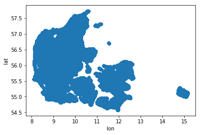
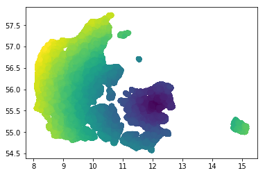

# Assignment 2: Data (Pre)processing and Simple Plotting

Gruppe Dangerous Memory: Jake, Christian, Alexander

## Tasks

#### 1.Read the entire dataset of Danish housing sales data, from Boliga, into a Pandas DataFrame. Use the read_csv function from the pandas module.

Using a few helper functions, download the zip file containing the boliga data, unzip the file containing the multiple CSV files and combine them. Finally read the combines CSV file into a pandas dataframe.


```python
import requests
import os.path
import sys
import zipfile
import glob
import pandas as pd

boliga_stats_url = "https://raw.github.com/datsoftlyngby/soft2019fall-bi-teaching-material/master/week36/assignment_2/boliga_stats.zip"
boliga_filename = "boliga_stats.zip"
boliga_extraction_folder = "boliga_stats"


def download_as_file(URL, file_name):
    '''Download file from given URL and save to file_name from parameters, if already exists, do nothing..'''

    if not os.path.isfile(file_name):

        try:
            print(f'Downloading {boliga_filename} from {boliga_stats_url}...')
            response = requests.get(URL)

            with open(file_name, 'wb') as the_file:
                the_file.write(response.content)

        except Exception as e:
            print(f'Error downloading {boliga_filename}; ', e)
            sys.exit(1)
        print(f'{boliga_filename} downloaded.')
    else:
        print(f'{boliga_filename} already downloaded')


def unzip_file(file_to_unzip, extraction_folder):
    '''unzip given zipfile to given extraction folder, if given folder is empty'''
    if not os.path.exists(extraction_folder):
        os.makedirs(extraction_folder)
    if len(os.listdir(boliga_extraction_folder)) == 0:
        print(f'Extracting {boliga_filename} into folder {boliga_extraction_folder}.')
        with zipfile.ZipFile(file_to_unzip, 'r') as zip_ref:
            zip_ref.extractall(extraction_folder)
    else: 
        print(f'{boliga_filename} already extracted.')


def combine_all_csv():
    '''
    Combine multiple CSV files
    https://www.freecodecamp.org/news/how-to-combine-multiple-csv-files-with-8-lines-of-code-265183e0854/
    '''
    print(f'Combining all csv files into boliga_all.csv ...')
    os.chdir(boliga_extraction_folder)
    all_filenames = [i for i in glob.glob('*.{}'.format('csv'))]
    #combine all files in the list
    combined_csv = pd.concat([pd.read_csv(f) for f in all_filenames ])
    os.chdir('..')
    #export to csv
    combined_csv.to_csv( "boliga_all.csv", index=False, encoding='utf-8-sig')
    print("Done!")

download_as_file(boliga_stats_url, boliga_filename)
unzip_file(boliga_filename, boliga_extraction_folder)
combine_all_csv()

df = pd.read_csv('boliga_all.csv')
```

    Downloading boliga_stats.zip from https://raw.github.com/datsoftlyngby/soft2019fall-bi-teaching-material/master/week36/assignment_2/boliga_stats.zip...
    boliga_stats.zip downloaded.
    Extracting boliga_stats.zip into folder boliga_stats.
    Combining all csv files into boliga_all.csv ...
    Done!
    

Cleanup of the multiple CSV files & zip file:


```bash
%%bash
rm -r "boliga_stats"
rm "boliga_stats.zip"
echo done cleaning up
```

    done cleaning up
    

#### 2. Geocode the the entire dataset of Danish housing sales data. Add two new columns to the DataFrame, one for latitude (lat) and one for longitude (lon) coordinates per address. Do the geocoding with help of the OSM dataset stored in a file as discussed in class. Save that DataFrame to a CSV file with the help of pandas'

Remove null (NaN) values from the dataset:


```python
df_data = df[(~df['address'].isnull()) & (~df['zip_code'].isnull())]
```

We have decided to use the JSON file provided here: (https://github.com/datsoftlyngby/soft2019fall-bi-teaching-material/blob/master/week36/assignment_2/postcodes.zip) with pd.read_json we put the data in a dataframe


```python
df_osm = pd.read_json('../../../soft2019fall-bi-teaching-material/week36/assignment_2/postcodes/postcodes.json', orient='index')
```

We then define a method we will use to process the df_osm dataframe.

We are using a try except block because there is around 20k addresses in df_data that doesn't follow the normal rules.


```python
def lambdaFunction(address, zip_code):
    try:
        address_no_side = address.split(',')[0]
        split_address = address_no_side.split(' ')
        split_zip_code = zip_code.split(' ')
        street = " ".join(split_address[:-1])
        house_number = split_address[-1]
        zip_code_number = split_zip_code[0]
        df_osm_lat_lon = df_osm.loc[zip_code_number].loc[street][house_number]
        return df_osm_lat_lon
    except:
        t=0
```

We then add lon and lat to df_data using a lambda expression to execute a method on each row in the dataframe.


```python
from tqdm import tqdm
tqdm.pandas(desc="Adding lon and lat")

df_data[['lon', 'lat']] = df_data.progress_apply(lambda x : pd.Series(lambdaFunction(x['address'], x['zip_code'])), axis=1)
        
df_data.to_csv(r'osm_export.csv')
```

    Adding lon and lat: 100%|██████████| 1385309/1385309 [27:46<00:00, 831.49it/s] 
    

#### 3. Convert all sales dates in the dataset into proper datetime objects, see http://pandas.pydata.org/pandas-docs/stable/generated/pandas.to_datetime.html.


```python
df_data['sell_date'] = pd.to_datetime(df_data['sell_date'], dayfirst = True)
df_data['sell_date']
```


    0         2017-05-08
    1         2017-05-04
    2         2017-05-02
    3         2017-05-01
    4         2017-04-06
    5         2017-04-05
    6         2017-03-28
    7         2017-03-21
    8         2017-03-09
    9         2017-02-25
    10        2017-02-24
    11        2017-02-23
    12        2017-02-10
    13        2017-01-31
    14        2017-01-26
    15        2017-01-18
    16        2017-01-18
    17        2017-01-05
    18        2017-01-03
    19        2016-12-27
    20        2016-12-22
    21        2016-12-22
    22        2016-12-20
    23        2016-12-20
    24        2016-12-13
    25        2016-12-12
    26        2016-12-12
    27        2016-12-07
    28        2016-11-25
    29        2016-11-25
                 ...    
    1385279   1994-01-29
    1385280   1994-01-13
    1385281   1994-01-05
    1385282   1993-11-11
    1385283   1993-10-27
    1385284   1993-10-26
    1385285   1993-10-24
    1385286   1993-10-09
    1385287   1993-09-23
    1385288   1993-09-08
    1385289   1993-08-16
    1385290   1993-06-25
    1385291   1993-04-06
    1385292   1993-03-10
    1385293   1993-02-11
    1385294   1993-01-04
    1385295   1992-12-17
    1385296   1992-08-17
    1385297   1992-07-01
    1385298   1992-06-15
    1385299   1992-05-12
    1385300   1992-04-21
    1385301   1992-04-16
    1385302   1992-04-16
    1385303   1992-03-23
    1385304   1992-03-06
    1385305   1992-03-03
    1385306   1992-02-02
    1385307   1992-01-23
    1385308   1992-01-06
    Name: sell_date, Length: 1385309, dtype: datetime64[ns]


#### 4. Compute the average price per square meter for the years 1992 and 2016 respectively for the city centers of Copenhagen (zip code 1050-1499), Odense (zip code 5000), Aarhus (zip code 8000), and Aalborg (zip code 9000). Create two new DataFrames, one for the year 1992 and one for the year 2016, which contain the respective zip codes and the average price per square meter corresponding to the aforementioned cities. Let the DataFrames be sorted by ascending prices.


```python
zip_codes_for_df_mean = ['5000','8000','9000']
lst = range(1050,1499)
zip_codes_1050_1499 = ["{:01d}".format(x) for x in lst]
zip_codes_for_df_mean = zip_codes_1050_1499 + zip_codes_for_df_mean

df_1992 = df_data[(df_data['sell_date'].dt.year == 1992)].copy()
df_1992_mean = df_1992[(df_1992['zip_code'].str.startswith(tuple(zip_codes_for_df_mean)))].groupby('zip_code').mean().sort_values('price').copy()
df_2016 = df_data[(df_data['sell_date'].dt.year == 2016)].copy()
df_2016_mean = df_2016[(df_2016['zip_code'].str.startswith(tuple(zip_codes_for_df_mean)))].groupby('zip_code').mean().sort_values('price').copy()
```


```python
from IPython.display import display, clear_output
display(df_1992_mean, df_2016_mean)
```


<div>
<style scoped>
    .dataframe tbody tr th:only-of-type {
        vertical-align: middle;
    }

    .dataframe tbody tr th {
        vertical-align: top;
    }

    .dataframe thead th {
        text-align: right;
    }
</style>
<table border="1" class="dataframe">
  <thead>
    <tr style="text-align: right;">
      <th></th>
      <th>price</th>
      <th>price_per_sq_m</th>
      <th>no_rooms</th>
      <th>size_in_sq_m</th>
      <th>year_of_construction</th>
      <th>price_change_in_pct</th>
      <th>lon</th>
      <th>lat</th>
    </tr>
    <tr>
      <th>zip_code</th>
      <th></th>
      <th></th>
      <th></th>
      <th></th>
      <th></th>
      <th></th>
      <th></th>
      <th></th>
    </tr>
  </thead>
  <tbody>
    <tr>
      <th>1304 København K</th>
      <td>1.070000e+05</td>
      <td>2018.000000</td>
      <td>2.000000</td>
      <td>53.000000</td>
      <td>1957.000000</td>
      <td>0.0</td>
      <td>12.584333</td>
      <td>55.685203</td>
    </tr>
    <tr>
      <th>1428 København K</th>
      <td>2.890000e+05</td>
      <td>5351.000000</td>
      <td>2.000000</td>
      <td>54.000000</td>
      <td>1901.000000</td>
      <td>0.0</td>
      <td>12.598423</td>
      <td>55.676045</td>
    </tr>
    <tr>
      <th>1429 København K</th>
      <td>2.990000e+05</td>
      <td>6795.000000</td>
      <td>2.000000</td>
      <td>44.000000</td>
      <td>1901.000000</td>
      <td>0.0</td>
      <td>12.598289</td>
      <td>55.675441</td>
    </tr>
    <tr>
      <th>1263 København K</th>
      <td>3.060000e+05</td>
      <td>2615.000000</td>
      <td>4.000000</td>
      <td>117.000000</td>
      <td>1876.000000</td>
      <td>0.0</td>
      <td>12.593512</td>
      <td>55.687578</td>
    </tr>
    <tr>
      <th>1300 København K</th>
      <td>3.100000e+05</td>
      <td>7045.000000</td>
      <td>1.000000</td>
      <td>44.000000</td>
      <td>1974.000000</td>
      <td>0.0</td>
      <td>12.586512</td>
      <td>55.685052</td>
    </tr>
    <tr>
      <th>1208 København K</th>
      <td>3.150000e+05</td>
      <td>4846.000000</td>
      <td>3.000000</td>
      <td>65.000000</td>
      <td>1796.000000</td>
      <td>0.0</td>
      <td>12.576699</td>
      <td>55.677610</td>
    </tr>
    <tr>
      <th>1424 København K</th>
      <td>4.333720e+05</td>
      <td>5702.000000</td>
      <td>3.000000</td>
      <td>76.000000</td>
      <td>1894.000000</td>
      <td>0.0</td>
      <td>12.587664</td>
      <td>55.670068</td>
    </tr>
    <tr>
      <th>1408 København K</th>
      <td>4.688085e+05</td>
      <td>5448.500000</td>
      <td>2.000000</td>
      <td>88.000000</td>
      <td>1750.000000</td>
      <td>0.0</td>
      <td>12.591689</td>
      <td>55.673918</td>
    </tr>
    <tr>
      <th>1366 København K</th>
      <td>5.550000e+05</td>
      <td>7115.000000</td>
      <td>3.000000</td>
      <td>78.000000</td>
      <td>1888.000000</td>
      <td>0.0</td>
      <td>12.565461</td>
      <td>55.683614</td>
    </tr>
    <tr>
      <th>5000 Odense C</th>
      <td>5.729066e+05</td>
      <td>5452.180723</td>
      <td>4.382979</td>
      <td>117.393617</td>
      <td>1930.436170</td>
      <td>0.0</td>
      <td>10.392969</td>
      <td>55.404147</td>
    </tr>
    <tr>
      <th>9000 Aalborg</th>
      <td>5.946942e+05</td>
      <td>4606.680851</td>
      <td>4.485876</td>
      <td>131.661017</td>
      <td>1949.644068</td>
      <td>0.0</td>
      <td>9.908587</td>
      <td>57.038595</td>
    </tr>
    <tr>
      <th>1051 København K</th>
      <td>6.000000e+05</td>
      <td>5405.000000</td>
      <td>2.000000</td>
      <td>111.000000</td>
      <td>1880.000000</td>
      <td>0.0</td>
      <td>12.591489</td>
      <td>55.679262</td>
    </tr>
    <tr>
      <th>1354 København K</th>
      <td>6.496250e+05</td>
      <td>4690.500000</td>
      <td>5.000000</td>
      <td>138.500000</td>
      <td>1885.000000</td>
      <td>0.0</td>
      <td>12.571547</td>
      <td>55.689661</td>
    </tr>
    <tr>
      <th>1201 København K</th>
      <td>6.500000e+05</td>
      <td>7142.000000</td>
      <td>3.000000</td>
      <td>91.000000</td>
      <td>1796.000000</td>
      <td>0.0</td>
      <td>12.578429</td>
      <td>55.678173</td>
    </tr>
    <tr>
      <th>1420 København K</th>
      <td>6.900000e+05</td>
      <td>8646.000000</td>
      <td>3.500000</td>
      <td>76.500000</td>
      <td>1844.000000</td>
      <td>0.0</td>
      <td>12.591565</td>
      <td>55.671870</td>
    </tr>
    <tr>
      <th>1455 København K</th>
      <td>6.950000e+05</td>
      <td>7135.000000</td>
      <td>3.000000</td>
      <td>99.000000</td>
      <td>1799.000000</td>
      <td>0.0</td>
      <td>12.569997</td>
      <td>55.678975</td>
    </tr>
    <tr>
      <th>1270 København K</th>
      <td>7.100000e+05</td>
      <td>9594.000000</td>
      <td>2.000000</td>
      <td>74.000000</td>
      <td>1939.000000</td>
      <td>0.0</td>
      <td>12.591616</td>
      <td>55.688319</td>
    </tr>
    <tr>
      <th>1265 København K</th>
      <td>7.875000e+05</td>
      <td>5586.500000</td>
      <td>4.500000</td>
      <td>141.500000</td>
      <td>1885.000000</td>
      <td>0.0</td>
      <td>12.588690</td>
      <td>55.684738</td>
    </tr>
    <tr>
      <th>1112 København K</th>
      <td>8.000000e+05</td>
      <td>9756.000000</td>
      <td>2.000000</td>
      <td>82.000000</td>
      <td>1991.000000</td>
      <td>0.0</td>
      <td>12.578256</td>
      <td>55.681584</td>
    </tr>
    <tr>
      <th>1425 København K</th>
      <td>8.380000e+05</td>
      <td>6623.333333</td>
      <td>4.333333</td>
      <td>120.666667</td>
      <td>1938.000000</td>
      <td>0.0</td>
      <td>12.594774</td>
      <td>55.671798</td>
    </tr>
    <tr>
      <th>1253 København K</th>
      <td>9.000000e+05</td>
      <td>14516.000000</td>
      <td>2.000000</td>
      <td>62.000000</td>
      <td>1778.000000</td>
      <td>0.0</td>
      <td>12.596992</td>
      <td>55.685755</td>
    </tr>
    <tr>
      <th>1058 København K</th>
      <td>9.500000e+05</td>
      <td>10555.000000</td>
      <td>2.000000</td>
      <td>90.000000</td>
      <td>1870.000000</td>
      <td>0.0</td>
      <td>12.589356</td>
      <td>55.676883</td>
    </tr>
    <tr>
      <th>1306 København K</th>
      <td>9.580000e+05</td>
      <td>7664.000000</td>
      <td>5.000000</td>
      <td>125.000000</td>
      <td>1882.000000</td>
      <td>0.0</td>
      <td>12.585167</td>
      <td>55.688122</td>
    </tr>
    <tr>
      <th>1414 København K</th>
      <td>9.820000e+05</td>
      <td>7064.000000</td>
      <td>4.000000</td>
      <td>139.000000</td>
      <td>1777.000000</td>
      <td>0.0</td>
      <td>12.591762</td>
      <td>55.673425</td>
    </tr>
    <tr>
      <th>8000 Aarhus C</th>
      <td>1.005108e+06</td>
      <td>7172.032787</td>
      <td>3.871429</td>
      <td>107.842857</td>
      <td>1919.528571</td>
      <td>0.0</td>
      <td>10.201584</td>
      <td>56.152849</td>
    </tr>
    <tr>
      <th>1264 København K</th>
      <td>1.268500e+06</td>
      <td>8121.500000</td>
      <td>4.000000</td>
      <td>178.000000</td>
      <td>1856.000000</td>
      <td>0.0</td>
      <td>12.590342</td>
      <td>55.687266</td>
    </tr>
    <tr>
      <th>1267 København K</th>
      <td>1.300000e+06</td>
      <td>6403.000000</td>
      <td>4.000000</td>
      <td>203.000000</td>
      <td>1925.000000</td>
      <td>0.0</td>
      <td>12.590586</td>
      <td>55.688514</td>
    </tr>
    <tr>
      <th>1127 København K</th>
      <td>3.000000e+06</td>
      <td>13157.000000</td>
      <td>5.000000</td>
      <td>228.000000</td>
      <td>1839.000000</td>
      <td>0.0</td>
      <td>12.576073</td>
      <td>55.682941</td>
    </tr>
    <tr>
      <th>1406 København K</th>
      <td>6.000000e+06</td>
      <td>23166.000000</td>
      <td>5.000000</td>
      <td>259.000000</td>
      <td>1736.000000</td>
      <td>0.0</td>
      <td>12.592714</td>
      <td>55.675362</td>
    </tr>
    <tr>
      <th>1255 København K</th>
      <td>7.900000e+06</td>
      <td>54482.000000</td>
      <td>5.000000</td>
      <td>145.000000</td>
      <td>1700.000000</td>
      <td>0.0</td>
      <td>12.588284</td>
      <td>55.680917</td>
    </tr>
    <tr>
      <th>1307 København K</th>
      <td>9.870833e+06</td>
      <td>138050.000000</td>
      <td>4.333333</td>
      <td>107.666667</td>
      <td>1893.666667</td>
      <td>0.0</td>
      <td>12.582725</td>
      <td>55.686317</td>
    </tr>
  </tbody>
</table>
</div>


<div>
<style scoped>
    .dataframe tbody tr th:only-of-type {
        vertical-align: middle;
    }

    .dataframe tbody tr th {
        vertical-align: top;
    }

    .dataframe thead th {
        text-align: right;
    }
</style>
<table border="1" class="dataframe">
  <thead>
    <tr style="text-align: right;">
      <th></th>
      <th>price</th>
      <th>price_per_sq_m</th>
      <th>no_rooms</th>
      <th>size_in_sq_m</th>
      <th>year_of_construction</th>
      <th>price_change_in_pct</th>
      <th>lon</th>
      <th>lat</th>
    </tr>
    <tr>
      <th>zip_code</th>
      <th></th>
      <th></th>
      <th></th>
      <th></th>
      <th></th>
      <th></th>
      <th></th>
      <th></th>
    </tr>
  </thead>
  <tbody>
    <tr>
      <th>1418 København K</th>
      <td>1.757500e+06</td>
      <td>31157.666667</td>
      <td>2.166667</td>
      <td>59.166667</td>
      <td>1953.833333</td>
      <td>-2.500000</td>
      <td>12.591141</td>
      <td>55.670680</td>
    </tr>
    <tr>
      <th>5000 Odense C</th>
      <td>1.815754e+06</td>
      <td>19378.442120</td>
      <td>3.314763</td>
      <td>97.200557</td>
      <td>1935.123955</td>
      <td>-2.142061</td>
      <td>10.392997</td>
      <td>55.401462</td>
    </tr>
    <tr>
      <th>1173 København K</th>
      <td>1.897500e+06</td>
      <td>27107.000000</td>
      <td>1.000000</td>
      <td>70.000000</td>
      <td>1818.000000</td>
      <td>0.000000</td>
      <td>12.573982</td>
      <td>55.681790</td>
    </tr>
    <tr>
      <th>9000 Aalborg</th>
      <td>1.934649e+06</td>
      <td>19624.186047</td>
      <td>3.295352</td>
      <td>98.492123</td>
      <td>1943.789355</td>
      <td>-1.593703</td>
      <td>9.917469</td>
      <td>57.042040</td>
    </tr>
    <tr>
      <th>1130 København K</th>
      <td>2.087500e+06</td>
      <td>21778.500000</td>
      <td>3.000000</td>
      <td>94.500000</td>
      <td>1863.000000</td>
      <td>0.000000</td>
      <td>12.574504</td>
      <td>55.683632</td>
    </tr>
    <tr>
      <th>1464 København K</th>
      <td>2.125000e+06</td>
      <td>20432.000000</td>
      <td>4.000000</td>
      <td>104.000000</td>
      <td>1796.000000</td>
      <td>0.000000</td>
      <td>12.573034</td>
      <td>55.676486</td>
    </tr>
    <tr>
      <th>1429 København K</th>
      <td>2.163823e+06</td>
      <td>41513.777778</td>
      <td>1.962963</td>
      <td>52.222222</td>
      <td>1901.074074</td>
      <td>-1.259259</td>
      <td>12.598471</td>
      <td>55.675577</td>
    </tr>
    <tr>
      <th>1368 København K</th>
      <td>2.297000e+06</td>
      <td>46918.000000</td>
      <td>2.000000</td>
      <td>49.400000</td>
      <td>1881.000000</td>
      <td>0.200000</td>
      <td>12.563557</td>
      <td>55.681346</td>
    </tr>
    <tr>
      <th>1428 København K</th>
      <td>2.307912e+06</td>
      <td>40067.117647</td>
      <td>2.294118</td>
      <td>57.000000</td>
      <td>1901.470588</td>
      <td>-1.411765</td>
      <td>12.597851</td>
      <td>55.675698</td>
    </tr>
    <tr>
      <th>1110 København K</th>
      <td>2.333750e+06</td>
      <td>25797.000000</td>
      <td>2.500000</td>
      <td>87.000000</td>
      <td>1848.000000</td>
      <td>-5.500000</td>
      <td>12.582491</td>
      <td>55.682040</td>
    </tr>
    <tr>
      <th>1356 København K</th>
      <td>2.350000e+06</td>
      <td>45192.000000</td>
      <td>2.000000</td>
      <td>52.000000</td>
      <td>1880.000000</td>
      <td>0.000000</td>
      <td>12.567263</td>
      <td>55.686842</td>
    </tr>
    <tr>
      <th>1454 København K</th>
      <td>2.419000e+06</td>
      <td>37768.000000</td>
      <td>1.666667</td>
      <td>64.666667</td>
      <td>1797.000000</td>
      <td>-3.000000</td>
      <td>12.569671</td>
      <td>55.678203</td>
    </tr>
    <tr>
      <th>1359 København K</th>
      <td>2.466241e+06</td>
      <td>41022.125000</td>
      <td>2.375000</td>
      <td>59.875000</td>
      <td>1883.000000</td>
      <td>-0.875000</td>
      <td>12.565368</td>
      <td>55.683405</td>
    </tr>
    <tr>
      <th>1370 København K</th>
      <td>2.478500e+06</td>
      <td>32880.454545</td>
      <td>2.363636</td>
      <td>85.090909</td>
      <td>1960.272727</td>
      <td>0.272727</td>
      <td>12.562323</td>
      <td>55.682662</td>
    </tr>
    <tr>
      <th>1207 København K</th>
      <td>2.495000e+06</td>
      <td>51979.000000</td>
      <td>1.000000</td>
      <td>48.000000</td>
      <td>1750.000000</td>
      <td>0.000000</td>
      <td>12.576875</td>
      <td>55.678103</td>
    </tr>
    <tr>
      <th>1156 København K</th>
      <td>2.500000e+06</td>
      <td>30864.000000</td>
      <td>3.000000</td>
      <td>81.000000</td>
      <td>1813.000000</td>
      <td>0.000000</td>
      <td>12.575264</td>
      <td>55.679401</td>
    </tr>
    <tr>
      <th>1472 København K</th>
      <td>2.525000e+06</td>
      <td>42083.000000</td>
      <td>2.000000</td>
      <td>60.000000</td>
      <td>1934.000000</td>
      <td>0.000000</td>
      <td>12.575924</td>
      <td>55.673720</td>
    </tr>
    <tr>
      <th>1422 København K</th>
      <td>2.551536e+06</td>
      <td>43930.285714</td>
      <td>2.285714</td>
      <td>57.714286</td>
      <td>1930.285714</td>
      <td>-2.642857</td>
      <td>12.591505</td>
      <td>55.670767</td>
    </tr>
    <tr>
      <th>1159 København K</th>
      <td>2.554500e+06</td>
      <td>32910.666667</td>
      <td>2.333333</td>
      <td>72.666667</td>
      <td>1802.666667</td>
      <td>-0.333333</td>
      <td>12.575086</td>
      <td>55.679840</td>
    </tr>
    <tr>
      <th>1129 København K</th>
      <td>2.609625e+06</td>
      <td>47549.500000</td>
      <td>2.250000</td>
      <td>55.000000</td>
      <td>1736.000000</td>
      <td>-4.000000</td>
      <td>12.574440</td>
      <td>55.683212</td>
    </tr>
    <tr>
      <th>8000 Aarhus C</th>
      <td>2.627758e+06</td>
      <td>33120.196970</td>
      <td>2.677419</td>
      <td>79.471014</td>
      <td>1943.096116</td>
      <td>-0.824885</td>
      <td>10.202243</td>
      <td>56.155952</td>
    </tr>
    <tr>
      <th>1063 København K</th>
      <td>2.635714e+06</td>
      <td>40685.000000</td>
      <td>2.142857</td>
      <td>64.285714</td>
      <td>1809.142857</td>
      <td>-3.428571</td>
      <td>12.583114</td>
      <td>55.677847</td>
    </tr>
    <tr>
      <th>1361 København K</th>
      <td>2.645000e+06</td>
      <td>40692.000000</td>
      <td>2.000000</td>
      <td>65.000000</td>
      <td>1880.000000</td>
      <td>-5.000000</td>
      <td>12.570441</td>
      <td>55.683501</td>
    </tr>
    <tr>
      <th>1071 København K</th>
      <td>2.647500e+06</td>
      <td>45675.500000</td>
      <td>2.000000</td>
      <td>58.000000</td>
      <td>1797.500000</td>
      <td>-1.000000</td>
      <td>12.582300</td>
      <td>55.677920</td>
    </tr>
    <tr>
      <th>1205 København K</th>
      <td>2.667220e+06</td>
      <td>28729.800000</td>
      <td>2.800000</td>
      <td>89.800000</td>
      <td>1803.800000</td>
      <td>-0.600000</td>
      <td>12.576680</td>
      <td>55.677191</td>
    </tr>
    <tr>
      <th>1400 København K</th>
      <td>2.688203e+06</td>
      <td>35974.500000</td>
      <td>2.500000</td>
      <td>74.000000</td>
      <td>1942.750000</td>
      <td>-1.750000</td>
      <td>12.591933</td>
      <td>55.672086</td>
    </tr>
    <tr>
      <th>1304 København K</th>
      <td>2.739455e+06</td>
      <td>40290.000000</td>
      <td>2.181818</td>
      <td>69.181818</td>
      <td>1962.454545</td>
      <td>-0.181818</td>
      <td>12.583590</td>
      <td>55.684293</td>
    </tr>
    <tr>
      <th>1210 København K</th>
      <td>2.749000e+06</td>
      <td>45766.500000</td>
      <td>2.000000</td>
      <td>61.500000</td>
      <td>1789.000000</td>
      <td>0.000000</td>
      <td>12.575228</td>
      <td>55.677390</td>
    </tr>
    <tr>
      <th>1430 København K</th>
      <td>2.760000e+06</td>
      <td>39838.333333</td>
      <td>2.666667</td>
      <td>72.333333</td>
      <td>1901.000000</td>
      <td>-0.333333</td>
      <td>12.599095</td>
      <td>55.676274</td>
    </tr>
    <tr>
      <th>1123 København K</th>
      <td>2.870800e+06</td>
      <td>35166.900000</td>
      <td>2.900000</td>
      <td>84.100000</td>
      <td>1857.200000</td>
      <td>-2.000000</td>
      <td>12.576622</td>
      <td>55.683588</td>
    </tr>
    <tr>
      <th>...</th>
      <td>...</td>
      <td>...</td>
      <td>...</td>
      <td>...</td>
      <td>...</td>
      <td>...</td>
      <td>...</td>
      <td>...</td>
    </tr>
    <tr>
      <th>1113 København K</th>
      <td>5.055000e+06</td>
      <td>42765.000000</td>
      <td>3.000000</td>
      <td>123.500000</td>
      <td>1902.000000</td>
      <td>-4.000000</td>
      <td>12.580222</td>
      <td>55.680254</td>
    </tr>
    <tr>
      <th>1074 København K</th>
      <td>5.116667e+06</td>
      <td>54432.000000</td>
      <td>3.000000</td>
      <td>94.000000</td>
      <td>1767.000000</td>
      <td>0.000000</td>
      <td>12.584526</td>
      <td>55.679738</td>
    </tr>
    <tr>
      <th>1062 København K</th>
      <td>5.275000e+06</td>
      <td>46681.000000</td>
      <td>4.000000</td>
      <td>113.000000</td>
      <td>1796.000000</td>
      <td>0.000000</td>
      <td>12.582083</td>
      <td>55.677552</td>
    </tr>
    <tr>
      <th>1434 København K</th>
      <td>5.375000e+06</td>
      <td>47991.000000</td>
      <td>4.000000</td>
      <td>112.000000</td>
      <td>2005.000000</td>
      <td>0.000000</td>
      <td>12.603562</td>
      <td>55.679334</td>
    </tr>
    <tr>
      <th>1439 København K</th>
      <td>5.500000e+06</td>
      <td>61797.000000</td>
      <td>3.000000</td>
      <td>89.000000</td>
      <td>1875.000000</td>
      <td>0.000000</td>
      <td>12.610349</td>
      <td>55.683779</td>
    </tr>
    <tr>
      <th>1264 København K</th>
      <td>5.514706e+06</td>
      <td>41695.882353</td>
      <td>3.529412</td>
      <td>137.794118</td>
      <td>1881.147059</td>
      <td>-2.000000</td>
      <td>12.587622</td>
      <td>55.684733</td>
    </tr>
    <tr>
      <th>1201 København K</th>
      <td>5.547500e+06</td>
      <td>41295.000000</td>
      <td>3.500000</td>
      <td>140.500000</td>
      <td>1796.000000</td>
      <td>-1.000000</td>
      <td>12.577818</td>
      <td>55.677965</td>
    </tr>
    <tr>
      <th>1051 København K</th>
      <td>5.580625e+06</td>
      <td>44519.875000</td>
      <td>3.500000</td>
      <td>136.625000</td>
      <td>1829.125000</td>
      <td>-10.625000</td>
      <td>12.590569</td>
      <td>55.680249</td>
    </tr>
    <tr>
      <th>1175 København K</th>
      <td>5.700000e+06</td>
      <td>30319.000000</td>
      <td>3.000000</td>
      <td>188.000000</td>
      <td>1856.000000</td>
      <td>0.000000</td>
      <td>12.572971</td>
      <td>55.682517</td>
    </tr>
    <tr>
      <th>1364 København K</th>
      <td>5.793125e+06</td>
      <td>41686.250000</td>
      <td>5.250000</td>
      <td>142.250000</td>
      <td>1877.750000</td>
      <td>-2.250000</td>
      <td>12.566807</td>
      <td>55.683917</td>
    </tr>
    <tr>
      <th>1310 København K</th>
      <td>5.873824e+06</td>
      <td>44434.235294</td>
      <td>3.411765</td>
      <td>123.058824</td>
      <td>1912.117647</td>
      <td>-1.294118</td>
      <td>12.590833</td>
      <td>55.685685</td>
    </tr>
    <tr>
      <th>1468 København K</th>
      <td>5.918782e+06</td>
      <td>41973.833333</td>
      <td>3.333333</td>
      <td>140.666667</td>
      <td>1877.000000</td>
      <td>-0.166667</td>
      <td>12.573769</td>
      <td>55.675613</td>
    </tr>
    <tr>
      <th>1268 København K</th>
      <td>5.950000e+06</td>
      <td>32513.000000</td>
      <td>4.500000</td>
      <td>167.000000</td>
      <td>1925.000000</td>
      <td>-2.000000</td>
      <td>12.590438</td>
      <td>55.688794</td>
    </tr>
    <tr>
      <th>1401 København K</th>
      <td>5.989386e+06</td>
      <td>49931.636364</td>
      <td>2.727273</td>
      <td>113.363636</td>
      <td>1796.181818</td>
      <td>-1.909091</td>
      <td>12.592214</td>
      <td>55.675214</td>
    </tr>
    <tr>
      <th>1256 København K</th>
      <td>6.250000e+06</td>
      <td>40662.000000</td>
      <td>3.500000</td>
      <td>151.250000</td>
      <td>1853.750000</td>
      <td>-2.250000</td>
      <td>12.591517</td>
      <td>55.683027</td>
    </tr>
    <tr>
      <th>1402 København K</th>
      <td>6.270833e+06</td>
      <td>45172.666667</td>
      <td>3.500000</td>
      <td>141.000000</td>
      <td>2002.166667</td>
      <td>-1.500000</td>
      <td>12.586306</td>
      <td>55.671897</td>
    </tr>
    <tr>
      <th>1100 København K</th>
      <td>6.425000e+06</td>
      <td>35796.500000</td>
      <td>3.000000</td>
      <td>193.000000</td>
      <td>1832.500000</td>
      <td>-6.000000</td>
      <td>12.583524</td>
      <td>55.679901</td>
    </tr>
    <tr>
      <th>1470 København K</th>
      <td>6.468000e+06</td>
      <td>42477.400000</td>
      <td>5.400000</td>
      <td>155.400000</td>
      <td>1680.000000</td>
      <td>-1.400000</td>
      <td>12.573923</td>
      <td>55.675049</td>
    </tr>
    <tr>
      <th>1203 København K</th>
      <td>6.500000e+06</td>
      <td>36521.750000</td>
      <td>5.000000</td>
      <td>178.750000</td>
      <td>1760.750000</td>
      <td>-4.000000</td>
      <td>12.575862</td>
      <td>55.676255</td>
    </tr>
    <tr>
      <th>1260 København K</th>
      <td>6.835000e+06</td>
      <td>41975.666667</td>
      <td>4.333333</td>
      <td>153.000000</td>
      <td>1855.666667</td>
      <td>-4.333333</td>
      <td>12.589755</td>
      <td>55.683789</td>
    </tr>
    <tr>
      <th>1250 København K</th>
      <td>6.861500e+06</td>
      <td>34043.600000</td>
      <td>4.000000</td>
      <td>183.800000</td>
      <td>1838.800000</td>
      <td>-3.400000</td>
      <td>12.591639</td>
      <td>55.681800</td>
    </tr>
    <tr>
      <th>1124 København K</th>
      <td>7.027650e+06</td>
      <td>45611.700000</td>
      <td>3.500000</td>
      <td>146.500000</td>
      <td>1878.100000</td>
      <td>-0.500000</td>
      <td>12.576612</td>
      <td>55.683189</td>
    </tr>
    <tr>
      <th>1267 København K</th>
      <td>7.114333e+06</td>
      <td>45494.333333</td>
      <td>4.333333</td>
      <td>159.666667</td>
      <td>1934.333333</td>
      <td>0.333333</td>
      <td>12.591069</td>
      <td>55.688489</td>
    </tr>
    <tr>
      <th>1265 København K</th>
      <td>7.435000e+06</td>
      <td>53327.333333</td>
      <td>4.333333</td>
      <td>142.000000</td>
      <td>1885.000000</td>
      <td>-1.000000</td>
      <td>12.589072</td>
      <td>55.684627</td>
    </tr>
    <tr>
      <th>1306 København K</th>
      <td>7.462500e+06</td>
      <td>48039.166667</td>
      <td>4.833333</td>
      <td>157.000000</td>
      <td>1804.500000</td>
      <td>-0.166667</td>
      <td>12.581696</td>
      <td>55.683590</td>
    </tr>
    <tr>
      <th>1150 København K</th>
      <td>8.585000e+06</td>
      <td>50285.200000</td>
      <td>3.800000</td>
      <td>147.600000</td>
      <td>1883.400000</td>
      <td>-2.400000</td>
      <td>12.579080</td>
      <td>55.679708</td>
    </tr>
    <tr>
      <th>1318 København K</th>
      <td>8.925000e+06</td>
      <td>72931.000000</td>
      <td>3.500000</td>
      <td>122.500000</td>
      <td>1873.500000</td>
      <td>-1.000000</td>
      <td>12.584575</td>
      <td>55.688460</td>
    </tr>
    <tr>
      <th>1263 København K</th>
      <td>9.488333e+06</td>
      <td>50118.333333</td>
      <td>4.333333</td>
      <td>169.000000</td>
      <td>1845.000000</td>
      <td>0.000000</td>
      <td>12.592724</td>
      <td>55.687487</td>
    </tr>
    <tr>
      <th>1437 København K</th>
      <td>9.694444e+06</td>
      <td>47612.333333</td>
      <td>5.333333</td>
      <td>204.777778</td>
      <td>1881.111111</td>
      <td>-9.222222</td>
      <td>12.603409</td>
      <td>55.680048</td>
    </tr>
    <tr>
      <th>1119 København K</th>
      <td>9.853200e+06</td>
      <td>55963.600000</td>
      <td>4.600000</td>
      <td>172.200000</td>
      <td>1819.400000</td>
      <td>-0.600000</td>
      <td>12.577577</td>
      <td>55.682904</td>
    </tr>
  </tbody>
</table>
<p>124 rows × 8 columns</p>
</div>


#### 5. Create, with the help of the pandas module, four new CSV files containing the sales data for the year 1992 for the city centers of Copenhagen (zip code 1050-1499), Odense (zip code 5000), Aarhus (zip code 8000), and Aalborg (zip code 9000).


```python
df_1992[(df_1992['zip_code'].str.startswith(tuple(zip_codes_1050_1499)))].to_csv(r'year-1992_zip-1050-1499.csv')
df_1992[(df_1992['zip_code'].str.startswith('5000'))].to_csv(r'year-1992_zip-5000.csv')
df_1992[(df_1992['zip_code'].str.startswith('8000'))].to_csv(r'year-1992_zip-8000.csv')
df_1992[(df_1992['zip_code'].str.startswith('9000'))].to_csv(r'year-1992_zip-9000.csv')
```

#### 6. Create a 2-dimensional scatter plot, which contains a dot for each location in the dataset of Danish housing sales data. Plot the longitude values on the x- axis and plot the latitude values on the y-axis.


```python
%matplotlib inline
df_data.plot.scatter(x = 'lon', y = 'lat')
```


    <matplotlib.axes._subplots.AxesSubplot at 0x7fbd8a068048>





#### 7. Use the following function, which computes the Haversine Distance (https://en.wikipedia.org/wiki/Haversine_formula) to compute an array of distances (distances) for each for each location in the dataset of Danish housing sales data to the city center of Roskilde (lat=55.65, lon=12.083333).


```python
import math
def haversine_distance(origin, destination):

    lat_orig, lon_orig = origin
    lat_dest, lon_dest = destination
    radius = 6371

    dlat = math.radians(lat_dest-lat_orig)
    dlon = math.radians(lon_dest-lon_orig)
    a = (math.sin(dlat / 2) * math.sin(dlat / 2) + math.cos(math.radians(lat_orig)) 
        * math.cos(math.radians(lat_dest)) * math.sin(dlon / 2) * math.sin(dlon / 2))
    c = 2 * math.atan2(math.sqrt(a), math.sqrt(1 - a))
    d = radius * c

    return d
```


```python
import matplotlib.pyplot as plt
#Roskilde (lat=55.65, lon=12.083333)

tqdm.pandas(desc="Creating haversine distance")

df_not_nan = df_data.dropna().copy()

list_df = df_not_nan.progress_apply(lambda y : haversine_distance(tuple([55.65,12.083333]), tuple([y['lat'], y['lon']])), axis=1)
```

    Creating haversine distance: 100%|██████████| 1280975/1280975 [01:58<00:00, 10837.14it/s]
    

#### 8. Create another scatter plot as in the task above, but use the computed distances as color values, see keyword arguments c= and cmap= in the documentation of the scatter function plt.scatter?.


```python
plt.scatter(x = df_not_nan.lon, y = df_not_nan.lat, c = list_df)
```


    <matplotlib.collections.PathCollection at 0x7fbd8a946b00>




